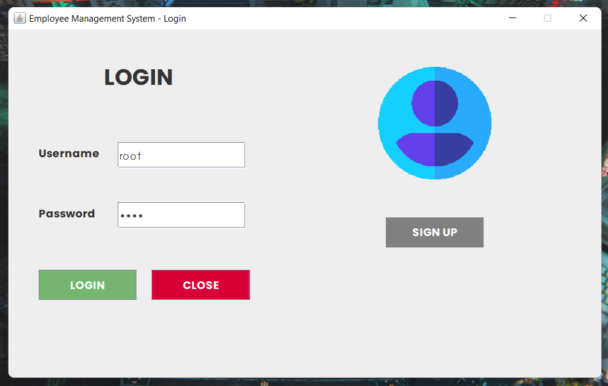
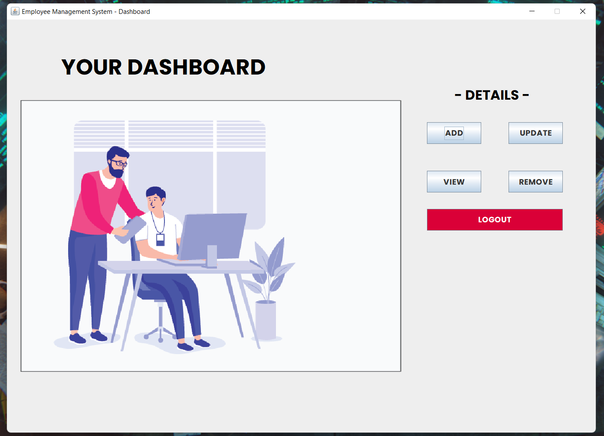
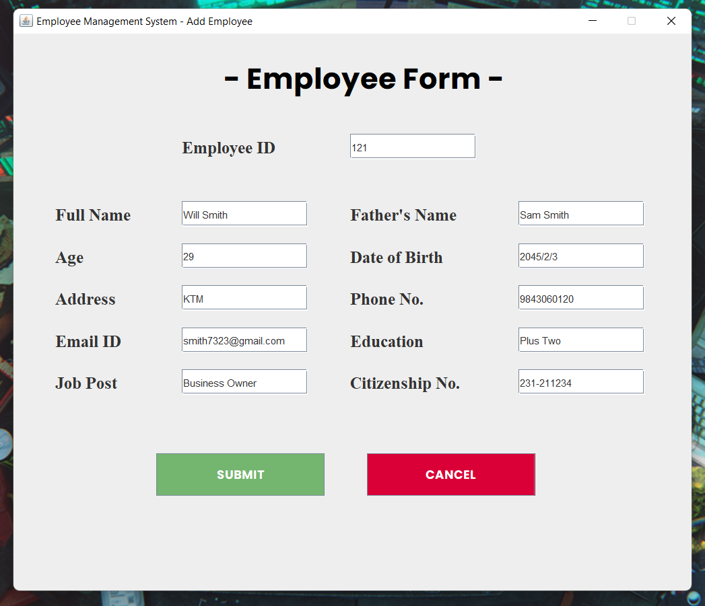
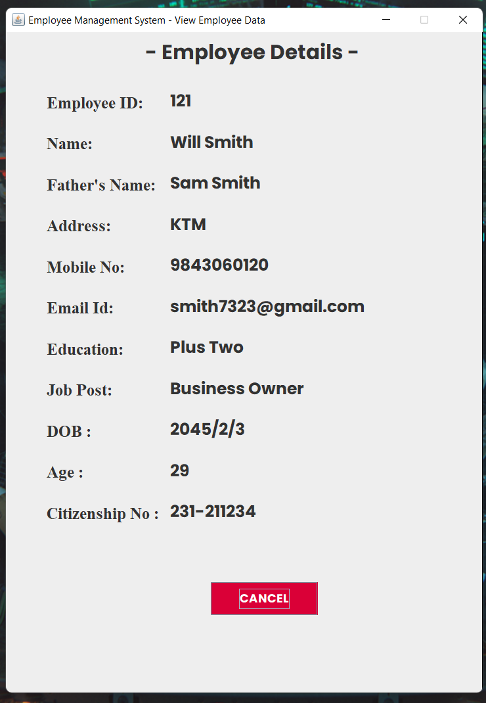

# EMPLOYEE MANAGEMENT SYSTEM :bust_in_silhouette:

The Project **Employee Management System Software** is developed using **SWING** , **JAVA** &amp; **MySQL**.

 ## Tools & Technology
 
 The tools used for this project are as shown below. If you don't have those tools you can follow below link to download.
 
 ### Tools🛠
 
 - [Github](https://github.com/signup?ref_cta=Sign+up&ref_loc=header+logged+out&ref_page=%2F&source=header-home) :octocat: for source code management.
 - [Git](https://git-scm.com/downloads) as version control.
 - [My SQL Workbench](https://dev.mysql.com/downloads/workbench/) is used for editing database query.
 - [Photoshop](https://www.adobe.com/products/photoshop/free-trial-download.html) to edit required images.
 - [IntelliJ](https://www.jetbrains.com/pycharm/download/#section=windows) as a editor for writing code for whole project.

 
 ### Technology👨‍💻
 
 - [Java](https://java.com/en/download/) as main programming language.
 - [SWING](#) java GUI widget for GUI interface.
 - [MySQL](https://www.mysql.com/downloads/) as a database.
 
 ## Screenshot🖼
 Few **Screenshot** of project are show below :
<table>

   <tr>
    <td> </td>
     <td></td>
   </tr>
   
  <tr>
    <td></td>
    <td></td>
  </tr>
  
  
 </table>
 

## Credits
**Websites, Blog Posts, Documentation**

### Coding 👨‍💻

[Javat T Point](https://www.javatpoint.com/java-tutorial) 

[TutorialsPoint](https://www.tutorialspoint.com/java/index.htm)

[GeeksforGeeks](https://www.geeksforgeeks.org/java/?ref=shm)

### Icon & Color 
[Flaticon](https://www.flaticon.com/)

[Color Hunt](https://colorhunt.co/palettes/black)

 
